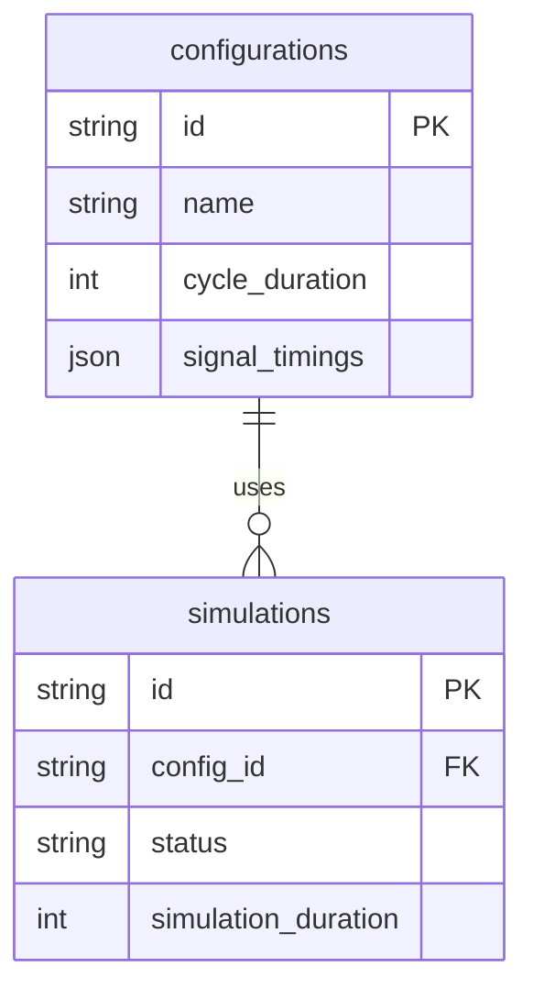

# Dátový model

## 1. Účel dokumentu

Tento dokument popisuje návrh dátového modelu pre projekt **Simulátor križovatky so semaformi**. Cieľom je presne definovať:

* aké entity sa budú ukladať do databázy,
* aké polia budú obsahovať,
* aké väzby existujú medzi entitami,

Dátový model slúži na ukladanie konfigurácií a výsledkov simulácií.

---

## 2. Rozsah dátového modelu

Databáza uchováva tieto oblasti:

### 2.1 Konfigurácie

* používateľské konfigurácie,
* prednastavené konfigurácie,
* metaúdaje o konfiguráciách.

### 2.2 Simulácie

* jednotlivé behy simulácie,
* vstupné parametre,
* stav simulácie,
* výsledné štatistiky.

### 2.3 História simulácií

* evidencia minulých behov,
* väzba na konfiguráciu,
* možnosť porovnania výsledkov.

---

## 3. Princípy

* databáza je relačná,
* identifikátory sú typu `string` (`conf_xxx`, `sim_xxx`),
* komplexné štruktúry sa ukladajú ako JSON,
* názvy polí sú v angličtine (súlad s API),
* konfigurácie a simulácie sú oddelené,
* backend je jediný zdroj pravdy.

---

## 4. Prehľad entít

Systém obsahuje dve hlavné entity:

* `configurations`
* `simulations`

---

## 5. Entita configurations

### 5.1 Účel

Tabuľka `configurations` uchováva konfigurácie časovania semaforov, ktoré používateľ vytvára a používa pri simuláciách.

### 5.2 Polia

| Pole              | Typ          | Popis                      |
| ----------------- | ------------ | -------------------------- |
| id                | VARCHAR(50)  | primárny kľúč              |
| name              | VARCHAR(200) | názov konfigurácie         |
| description       | TEXT         | popis konfigurácie         |
| cycle_duration    | INTEGER      | dĺžka cyklu                |
| signal_timings    | JSON         | časovanie 12 semaforov     |
| is_preset         | BOOLEAN      | prednastavená konfigurácia |
| cycle_utilization | FLOAT        | efektivita cyklu           |
| times_simulated   | INTEGER      | počet použití              |
| created_at        | TIMESTAMP    | dátum vytvorenia           |
| updated_at        | TIMESTAMP    | dátum úpravy               |

### 5.3 Poznámky

* `signal_timings` obsahuje všetkých 12 semaforov (N_S, N_L, …),
* `is_preset` určuje, či konfiguráciu možno upravovať,
* `times_simulated` sa využíva v UI,
* `cycle_utilization` vzniká pri validácii konfigurácie.

### 5.4 Príklad `signal_timings`

```json
{
  "N_S": {"start": 0, "duration": 50},
  "N_L": {"start": 50, "duration": 10},
  "N_R": {"start": 0, "duration": 50}
}
```

---

## 6. Entita simulations

### 6.1 Účel

Tabuľka `simulations` uchováva jednotlivé behy simulácie nad konkrétnou konfiguráciou.

### 6.2 Polia

| Pole                     | Typ         | Popis                  |
| ------------------------ | ----------- | ---------------------- |
| id                       | VARCHAR(50) | primárny kľúč          |
| config_id                | VARCHAR(50) | FK na configurations   |
| status                   | VARCHAR(20) | stav simulácie         |
| simulation_duration      | INTEGER     | trvanie simulácie      |
| traffic_intensity        | JSON        | intenzita dopravy      |
| started_at               | TIMESTAMP   | začiatok simulácie     |
| completed_at             | TIMESTAMP   | koniec simulácie       |
| elapsed_time             | FLOAT       | reálny čas             |
| total_vehicles_generated | INTEGER     | počet áut              |
| total_vehicles_passed    | INTEGER     | prejdené autá          |
| total_vehicles_waiting   | INTEGER     | čakajúce autá          |
| average_wait_time        | FLOAT       | priemerná čakacia doba |
| max_wait_time            | FLOAT       | maximálna čakacia doba |
| average_queue_length     | FLOAT       | priemerná dĺžka radu   |
| max_queue_length         | INTEGER     | maximálna dĺžka radu   |
| intersection_utilization | FLOAT       | využitie križovatky    |

### 6.3 Povolené hodnoty status


* `running`
* `completed`
* `stopped`
---

## 7. ER diagram

ER diagram znázorňuje vzťah medzi konfiguráciami a simuláciami.
Jedna konfigurácia môže byť použitá vo viacerých simuláciách.



---

## 8. Dátové typy

| Logický typ | SQL typ      |
| ----------- | ------------ |
| string      | VARCHAR      |
| integer     | INTEGER      |
| float       | FLOAT        |
| boolean     | BOOLEAN      |
| timestamp   | TIMESTAMP    |
| JSON        | JSON / JSONB |


---

## 9. Validácia dát

### 9.1 Konfigurácia

* názov je povinný,
* cycle_duration má povolený rozsah,
* všetkých 12 semaforov musí byť definovaných,
* konflikty sa nesmú prekrývať.

### 9.2 Simulácia

* config_id musí existovať,
* simulation_duration musí byť kladné,
* traffic_intensity obsahuje 4 smery,
* vehicle_speed je v povolenom rozsahu.

---

## 10. Indexy

### configurations

* id (PK)
* is_preset
* created_at

### simulations

* id (PK)
* config_id
* status
* started_at

---

## 11. SQL návrh

### configurations

```sql
CREATE TABLE configurations (
  id VARCHAR(50) PRIMARY KEY,
  name VARCHAR(200) NOT NULL,
  description TEXT,
  cycle_duration INTEGER NOT NULL,
  signal_timings JSON NOT NULL,
  is_preset BOOLEAN DEFAULT FALSE,
  cycle_utilization FLOAT,
  times_simulated INTEGER DEFAULT 0,
  created_at TIMESTAMP DEFAULT CURRENT_TIMESTAMP,
  updated_at TIMESTAMP DEFAULT CURRENT_TIMESTAMP
);
```

### simulations

```sql
CREATE TABLE simulations (
  id VARCHAR(50) PRIMARY KEY,
  config_id VARCHAR(50) NOT NULL,
  status VARCHAR(20) NOT NULL,
  simulation_duration INTEGER NOT NULL,
  traffic_intensity JSON NOT NULL,
  started_at TIMESTAMP DEFAULT CURRENT_TIMESTAMP,
  completed_at TIMESTAMP,
  elapsed_time FLOAT,
  total_vehicles_generated INTEGER,
  total_vehicles_passed INTEGER,
  total_vehicles_waiting INTEGER,
  average_wait_time FLOAT,
  max_wait_time FLOAT,
  average_queue_length FLOAT,
  max_queue_length INTEGER,
  intersection_utilization FLOAT,
  FOREIGN KEY (config_id) REFERENCES configurations(id)
);
```

---


## 12. Záver

Dátový model pokrýva:

* konfigurácie semaforov,
* simulácie,
* históriu a štatistiky.

