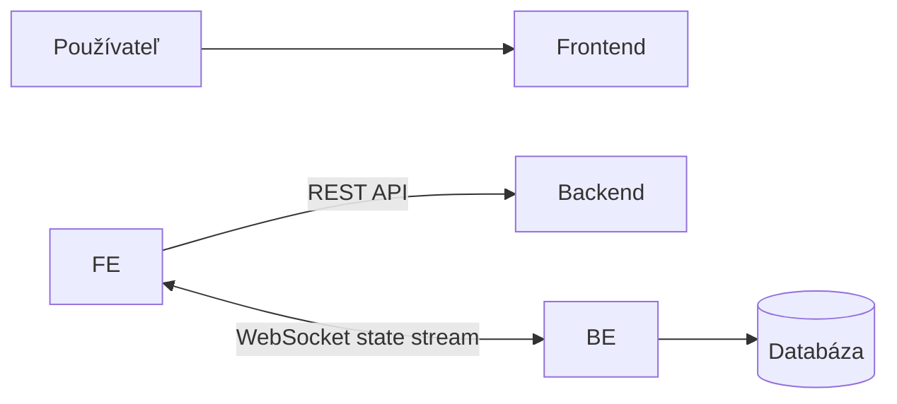
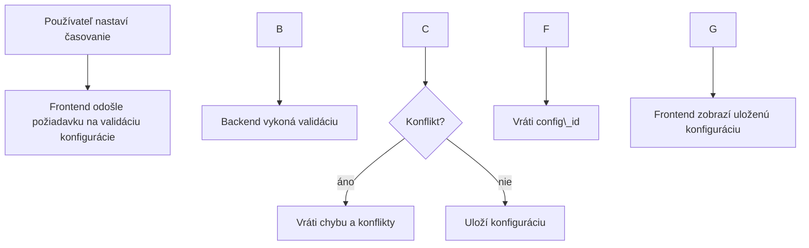
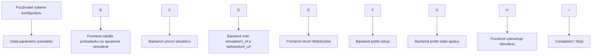
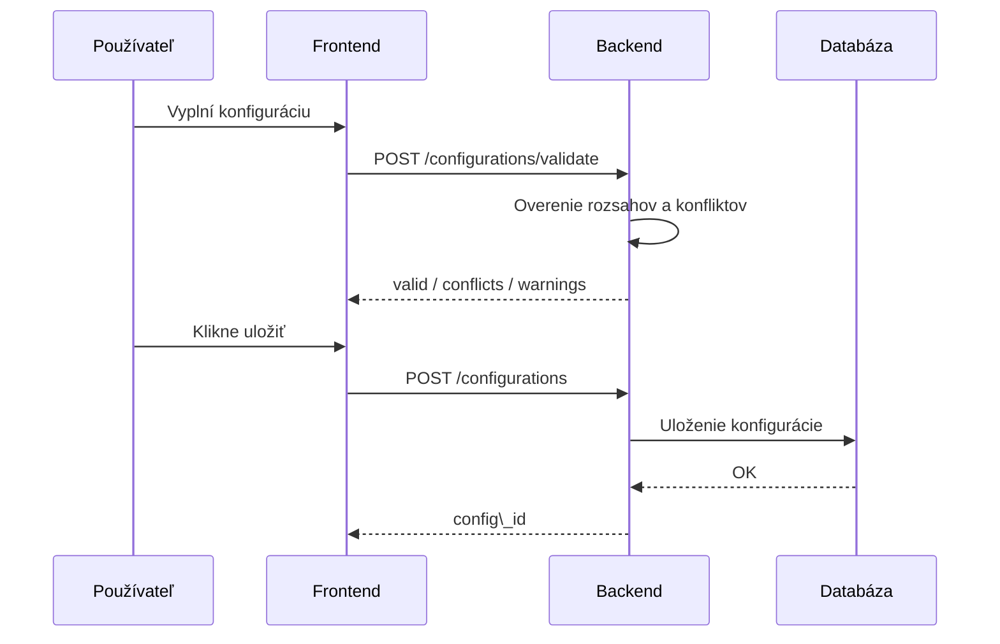
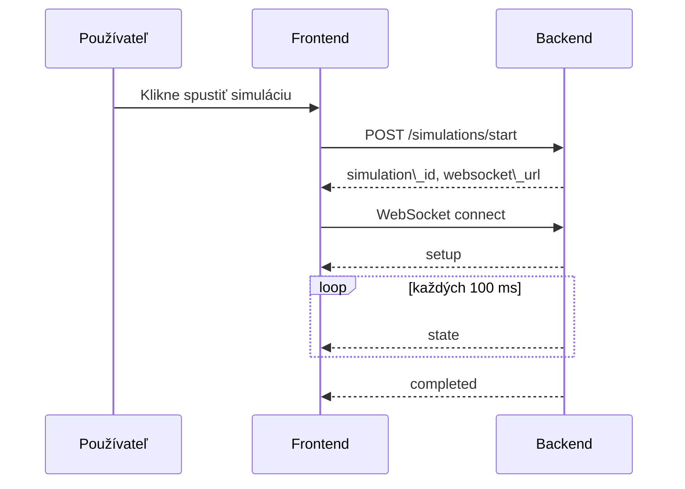

# Diagramy systému riadenia križovatky

## 1\. Component diagram

### Popis

Systém pozostáva z frontendovej a backendovej časti. Frontend komunikuje s backendom pomocou REST API pre štandardné operácie a pomocou WebSocket spojenia pre prenos dát simulácie v reálnom čase. Backend zabezpečuje logiku aplikácie a komunikáciu s databázou.

## 2\. Procesný diagram – vytvorenie konfigurácie

### Popis

Používateľ nastaví konfiguráciu križovatky. Backend overí správnosť nastavení a identifikuje prípadné konflikty medzi smermi premávky. Ak je konfigurácia validná, uloží sa do databázy.

## 3\. Procesný diagram – spustenie simulácie

### Popis

Po spustení simulácie backend inicializuje simuláciu a poskytne WebSocket spojenie. Frontend následne prijíma priebežné dáta o stave premávky a vizualizuje ich.

## 4\. Sekvenčný diagram – validácia konfigurácie

## 5\. Sekvenčný diagram – simulácia

