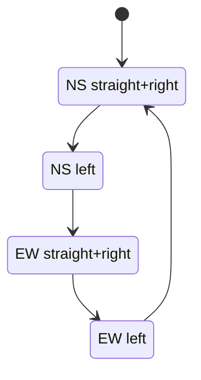
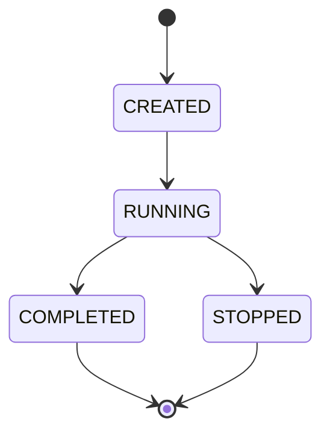

# Stavový automat križovatky

## 1. Účel dokumentu

Tento dokument popisuje logiku stavového automatu semaforov pre projekt **Simulátor križovatky so semaformi**. Cieľom je presne definovať:
- model križovatky,
- identifikáciu semaforov,
- povolené a zakázané kombinácie,
- fázy cyklu,
- prechody medzi stavmi.

---

## 2. Model križovatky

Križovatka má 4 vstupné smery:
- **North**
- **South**
- **East**
- **West**

Každý smer má 3 pohyby:
- **S** = straight,
- **L** = left,
- **R** = right.

### Identifikácia semaforov

| Kód | Význam |
|---|---|
| N_S | Sever → juh |
| N_L | Sever → západ |
| N_R | Sever → východ |
| S_S | Juh → sever |
| S_L | Juh → východ |
| S_R | Juh → západ |
| E_S | Východ → západ |
| E_L | Východ → juh |
| E_R | Východ → sever |
| W_S | Západ → východ |
| W_L | Západ → sever |
| W_R | Západ → juh |

---

## 3. Stavy semaforu

Každý semafor môže byť v jednom z dvoch stavov:
- `green`
- `red`

Zjednodušený model neobsahuje oranžovú fázu. Vždy sa teda kontroluje len to, či je konkrétny pohyb povolený alebo zakázaný.

---

## 4. Princíp stavového automatu

Stavový automat funguje cyklicky. Každý cyklus má dĺžku `cycle_duration` a je rozdelený na časové intervaly. V každom okamihu sa pre každý semafor vyhodnotí, či má byť:
- zelený, ak sa aktuálny čas nachádza v jeho intervale zelenej,
- červený, ak sa aktuálny čas nachádza mimo intervalu zelenej.

### Výpočet času v cykle
Aktuálny čas v cykle:
```text
cycle_time = simulation_time mod cycle_duration
```

---

## 5. Odporúčaný základný model fáz

Pre jednoduchú a bezpečnú verziu odporúčame rozdeliť cyklus na 4 hlavné fázy:

### Fáza 1 – Sever/Juh rovno + doprava
Zelená:
- N_S
- N_R
- S_S
- S_R

Červená:
- všetky ostatné

### Fáza 2 – Sever/Juh doľava
Zelená:
- N_L
- S_L

Červená:
- všetky ostatné

### Fáza 3 – Východ/Západ rovno + doprava
Zelená:
- E_S
- E_R
- W_S
- W_R

Červená:
- všetky ostatné

### Fáza 4 – Východ/Západ doľava
Zelená:
- E_L
- W_L

Červená:
- všetky ostatné

---

## 6. Stavový diagram – textová verzia



---

## 7. Konflikty medzi semaformi

### 7.1 Definícia konfliktu
Konflikt nastáva, keď dve jazdné dráhy vstupujú do toho istého priestoru križovatky a mohli by sa zraziť. Dva konfliktné semafory nesmú mať zelenú súčasne.

### 7.2 Základné konfliktné pravidlá

#### A. Odbočenie doľava vs protiidúci rovno
- N_L vs S_S
- S_L vs N_S
- E_L vs W_S
- W_L vs E_S

#### B. Odbočenie doľava vs protiidúci doprava
Podľa zvoleného zjednodušenia možno považovať za konfliktné aj:
- N_L vs S_R
- S_L vs N_R
- E_L vs W_R
- W_L vs E_R

#### C. Kolízne ľavé odbočenia
- N_L vs E_L
- E_L vs S_L
- S_L vs W_L
- W_L vs N_L

#### D. Križujúce sa odbočenie vľavo a pravé odbočenie
- N_L vs W_R
- E_L vs N_R
- S_L vs E_R
- W_L vs S_R

#### E. Krížové priame smery
- N_S vs E_S
- N_S vs W_S
- S_S vs E_S
- S_S vs W_S

---

## 8. Konfliktná matica

Odporúčaná implementácia v backende je pomocou konfliktnej matice 12 × 12.

Príklad reprezentácie:
```json
{
  "N_S": ["E_S", "W_S", "S_L"],
  "N_L": ["S_S", "S_R", "E_L", "W_R"],
  "N_R": [],
  "S_S": ["E_S", "W_S", "N_L"],
  "S_L": ["N_S", "N_R", "W_L", "E_R"],
  "S_R": [],
  "E_S": ["N_S", "S_S", "W_L"],
  "E_L": ["W_S", "W_R", "S_L", "N_R"],
  "E_R": [],
  "W_S": ["N_S", "S_S", "E_L"],
  "W_L": ["E_S", "E_R", "N_L", "S_R"],
  "W_R": []
}
```

---

## 9. Validácia konfigurácie

Backend pri ukladaní konfigurácie vykoná tieto kroky:

1. Overí rozsah `cycle_duration`.
2. Overí, že každý semafor má:
   - `0 <= start < cycle_duration`,
   - `0 <= duration <= cycle_duration`.
3. Z každého časovania vypočíta interval zelenej.
4. Prejde všetky dvojice konfliktných semaforov.
5. Overí, či sa ich intervaly neprekrývajú.
6. Ak sa prekrývajú, vráti chybu validácie.
7. Ak sa neprekrývajú, ale konfigurácia je neefektívna, vráti warning.

---

## 10. Algoritmus kontroly prekrytia intervalov

Každý semafor má interval:
```text
[start, start + duration)
```

Pri cyklickom čase môže interval pretekať cez koniec cyklu. Preto treba vedieť rozdeliť interval na:
- normálny interval,
- alebo 2 intervaly pri pretečení.

### Príklad
Ak:
- `cycle_duration = 120`
- `start = 110`
- `duration = 20`

potom zelená trvá:
- od 110 do 120,
- a od 0 do 10.

---

## 11. Stavový automat simulácie

Okrem samotných semaforov môže mať simulácia tieto stavy:



### Význam stavov
- `CREATED` – simulácia je vytvorená, ale ešte nezačala streamovať údaje.
- `RUNNING` – simulácia beží a posiela state správy.
- `COMPLETED` – simulácia skončila po uplynutí trvania.
- `STOPPED` – simulácia bola zastavená používateľom.

---

## 12. Správanie vozidla voči stavovému automatu

Každé vozidlo možno modelovať zjednodušene týmito stavmi:
- `generated`
- `approaching`
- `waiting`
- `crossing`
- `passed`

### Prechod vozidla
1. Vozidlo je vygenerované.
2. Prichádza ku križovatke.
3. Ak má jeho semafor červenú, čaká.
4. Ak má zelenú a cesta je voľná, prechádza.
5. Po prejdení opúšťa simuláciu.

---
## 13. Záver

Stavový automat je základom celého riešenia. Po jeho schválení by sa už nemala meniť:
- identifikácia semaforov,
- definícia fáz,
- konfliktlá matica,
- spôsob validácie intervalov.

Tým sa zabezpečí stabilný základ pre backend, frontend aj testovanie.